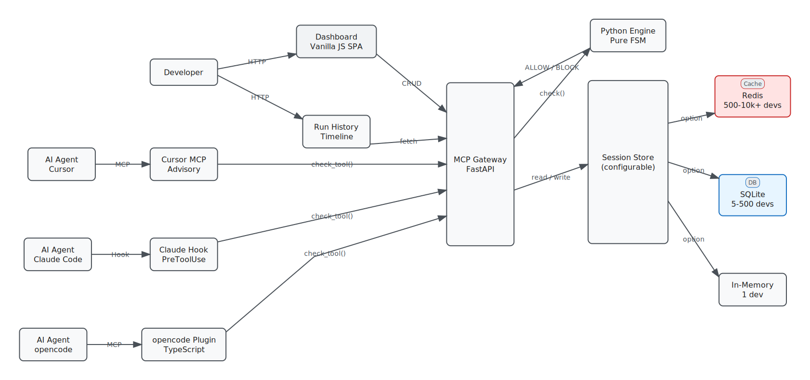

<p align="center">
  
</p>

<h1 align="center">Kitsune</h1>

<p align="center">A state machine harness for AI agent tool enforcement.</p>

<p align="center">
  <a href="./LICENSE"></a>
</p>

---

## Architecture

<p align="center">
  
</p>

**6 layers, left-to-right data flow:**

1. **External Actors** — AI agents (opencode, Claude Code, Cursor) + Developers
2. **Plugin Layer** — Thin adapters (<100 lines each) that intercept tool calls
3. **MCP Gateway** — FastAPI service: auth, session management, workflow CRUD, run history
4. **Python Engine** — Pure FSM function `check(phase, tool, workflow) → bool`
5. **Session Store** — User-configurable: Redis (cluster), SQLite (local), or In-Memory (single dev)
6. **Dashboard** — Vanilla JS SPA: visual editor, YAML editor, run history

---

## What it does

Kitsune wraps your AI coding agent in a finite state machine. Each workflow phase gates which tools are available.

```
PLAN       → read, grep, glob
IMPLEMENT  → read, edit, write
TEST       → read, bash (pytest, npm test, cargo test)
DONE       → workflow complete
```

The agent must emit triggers (`READY`, `DONE`, `PASS`, `FAIL`) to advance. Try the wrong tool in the wrong phase? Blocked. Tests fail? Loops back to `IMPLEMENT`.

---

## Quick start

```bash
pip install kitsune
kitsune editor          # open visual workflow editor
kitsune activate workflow.yaml
opencode "fix the bug in auth.py"
```

---

## Workflow example

```yaml
id: bugfix
initial: plan

phases:
  plan:
    tools: [read, grep, glob]
    max_turns: 8
    on:
      READY: implement

  implement:
    tools: [read, edit, write]
    max_edits: 20
    on:
      DONE: test

  test:
    tools: [read, bash]
    commands: [pytest, cargo test, npm test]
    on:
      PASS: done
      FAIL: implement

  done:
    type: final
```

---

## Guardrails

- **Bash discernment** — blocks redirects, destructive ops, script interpreters
- **Edit limits** — max lines per edit, max files per phase
- **Command allowlists** — only allowed test commands
- **Turn limits** — breaks read-loop death spirals
- **Approval gates** — human review before advancing

---

## License

[MPL-2.0](./LICENSE)
